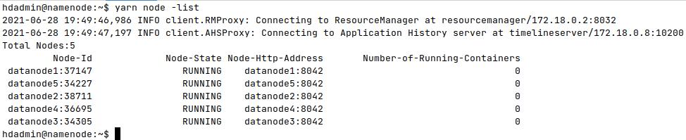

\pagebreak

# Tarea 1: Añadir al cluster un servidor de Backup y un TimeLineServer
## 1. Servidor de Backup

En primer lugar inicio el contendor donde estará el nodo de backup.

```bash
docker container run -ti --name backupnode \
  --network=hadoop-cluster --hostname backupnode \
  --cpus=1 --memory=3072m --expose 50100 \
  -p 50105:50105 hadoop-base /bin/bash
```

Dentro de ese contendor creo las carpetas necesarias y les doy los permisos adecuados.

```bash
cd opt/bd
mkdir backup
mkdir -p backup/dfs/name
chown -R hdadmin backup
```

Me convierto en el usuario hdadmin con el comando `su - hdadmin`.
Añado al archivo `core-site.xml` las propiedades `fs.defaultFS` y `hadoop.tmp.dir`, para indicar el sistema de ficheros por defecto y la carpeta donde se guardaran las copias de seguridad respectivamente.
Y al archivo `hdfs-site.xml` le añado las propiedades `dfs.namenode.backup.address` y `dfs.namenode.backup.http-address` para indicar las direcciones del nodo de backup.

```bash
hadoop_conf_backup_folder="hadoop_conf_backup"
mkdir -p "$hadoop_conf_backup_folder"

hadoop_conf_file="core-site.xml"
cp "$HADOOP_HOME/etc/hadoop/$hadoop_conf_file" "$hadoop_conf_backup_folder"
head -n -1 "$hadoop_conf_backup_folder/$hadoop_conf_file" > "$HADOOP_HOME/etc/hadoop/$hadoop_conf_file"
echo '  <property>
    <name>fs.defaultFS</name>
    <value>hdfs://namenode:9000/</value>
    <final>true</final>
  </property>
  <property>
    <name>hadoop.tmp.dir</name>
    <value>/opt/bd/backup</value>
    <final>true</final>
  </property>
</configuration>' >> "$HADOOP_HOME/etc/hadoop/$hadoop_conf_file"

hadoop_conf_file="hdfs-site.xml"
cp "$HADOOP_HOME/etc/hadoop/$hadoop_conf_file" "$hadoop_conf_backup_folder"
head -n -1 "$hadoop_conf_backup_folder/$hadoop_conf_file" > "$HADOOP_HOME/etc/hadoop/$hadoop_conf_file"
echo '  <property>
    <name>dfs.namenode.backup.address</name>
    <value>backupnode:50100</value>
    <final>true</final>
  </property>
  <property>
    <name>dfs.namenode.backup.http-address</name>
    <value>backupnode:50105</value>
    <final>true</final>
  </property>
</configuration>' >> "$HADOOP_HOME/etc/hadoop/$hadoop_conf_file"
```

Inicio el demonio.

```bash
hdfs namenode -backup
```
En la siguiente captura se puede ver al final el mensaje de que se ha realizado le checkpoint.  


A continuación se ve el contenido inicial de la carpeta de metadatos de NameNode.  


A continuación se ve el contenido inicial de la carpeta de backup de metadatos.  


A continuación entro en el contenedor del backupnode me cambio al usuario hdadmin e inspecciono los archivos que se han creado.

```bash
docker container exec -ti backupnode /bin/bash
su - hdadmin
find backup/
sha1sum backup/dfs/name/current/*
```

En la siguiente captura se puede ver que se han copiado unos archivos a la carpeta de backup con nombres parecidos a los de la carpeta de metadatos.  


Se muestran los hashes de los archivos en la carpeta de backup.  


Tambien entro en el nodo namenode e inspecciono los archivos

```bash
docker container exec -ti namenode /bin/bash
sha1sum /var/data/hdfs/namenode/current/*
```

Se muestran los hashes de los archivos en la carpeta de metadatos.  


Como podemos ver en las capturas donde se muestran los hashes, los archivos con el mismo nombre son iguales porque se ha realizado el checkpoint.

\pagebreak

En las siguientes capturas se muestra la interfaz web del nodo de backup.  


\pagebreak

## 2. TimeLineServer

En primer lugar entro al namenode y me cambio al usuario hdadmin.

```bash
docker container exec -ti namenode /bin/bash
su - hdadmin
```

Paro el resourcemanager.

```bash
yarn --daemon stop resourcemanager
```

Añado las propiedades `yarn.timeline-service.hostname`, `yarn.timeline-service.enabled` y `yarn.system-metrics-publisher.enabled` a `yarn-site.xml`.

```bash
hadoop_conf_file="yarn-site.xml"
cp "$HADOOP_HOME/etc/hadoop/$hadoop_conf_file" "$hadoop_conf_backup_folder"
head -n -1 "$hadoop_conf_backup_folder/$hadoop_conf_file" > "$HADOOP_HOME/etc/hadoop/$hadoop_conf_file"
echo '  <property>
    <name>yarn.timeline-service.hostname</name>
    <value>timelineserver</value>
    <final>true</final>
  </property>
  <property>
    <name>yarn.timeline-service.enabled</name>
    <value>true</value>
    <final>true</final>
  </property>
  <property>
    <name>yarn.system-metrics-publisher.enabled</name>
    <value>true</value>
    <final>true</final>
  </property>
</configuration>' >> "$HADOOP_HOME/etc/hadoop/$hadoop_conf_file"
```

Vuelvo a iniciar el demonio resourcemanager.

```bash
yarn --daemon start resourcemanager
```

Inicio un contenedor con el timelineserver.

```bash
docker container run -ti --name timelineserver \
  --network=hadoop-cluster --hostname timelineserver \
  --cpus=1 --memory=3072m --expose 10200 \
  -p 8188:8188 hadoop-base /bin/bash
```

Dentro de ese contenedor cambio el usuario a hdadmin e inicio el demonio timelineserver.

```bash
su - hdadmin
yarn --daemon start timelineserver
```
Una vez iniciado el timelineserver se puede ver su interfaz web en [http://localhost:8188/](http://localhost:8188/).

Ejecuto algunas tareas en el cluster.

```bash
docker container exec -ti namenode /bin/bash
su - hdadmin
export MAPRED_EXAMPLES=$HADOOP_HOME/share/hadoop/mapreduce
yarn jar $MAPRED_EXAMPLES/hadoop-mapreduce-examples-*.jar pi 16 1000
# screenshot
yarn jar $MAPRED_EXAMPLES/hadoop-mapreduce-examples-*.jar pi 16 1000
```

Las siguientes capturas son de la interfaz web del TimeLineServer:

- La primera no hay ninguna tarea en el historial.
- La segunda se ejecuta una vez cálculo de pi.
- La tercera es la segunda ejecución de cálculo de pi.


\pagebreak

# Tarea 2: Añadir un nuevo DataNode/NodeManager

En primer lugar entro al namenode y me cambio al usuario hdadmin.

```bash
docker container exec -ti namenode /bin/bash
su - hdadmin
```

Creo los ficheros y les añado la lista de nodos.

```bash
touch ${HADOOP_HOME}/etc/hadoop/dfs.include \
  ${HADOOP_HOME}/etc/hadoop/dfs.exclude \
  ${HADOOP_HOME}/etc/hadoop/yarn.include \
  ${HADOOP_HOME}/etc/hadoop/yarn.exclude

echo "datanode1
datanode2
datanode3
datanode4" > ${HADOOP_HOME}/etc/hadoop/dfs.include

echo "datanode1
datanode2
datanode3
datanode4" > ${HADOOP_HOME}/etc/hadoop/yarn.include
```

Añado a `hdfs-site.xml` las propiedades `dfs.hosts` y `dfs.hosts.exclude`.
Y añado a `yarn-site.xml` las propiedades `yarn.resourcemanager.nodes.include-path` y `yarn.resourcemanager.nodes.exclude-path`.
Despues reinicio los demonios para que recargen los ficheros de configuracion modificados.

```bash
hadoop_conf_backup_folder="hadoop_conf_backup"
mkdir -p "$hadoop_conf_backup_folder"

hadoop_conf_file="hdfs-site.xml"
cp "$HADOOP_HOME/etc/hadoop/$hadoop_conf_file" "$hadoop_conf_backup_folder"
head -n -1 "$hadoop_conf_backup_folder/$hadoop_conf_file" > "$HADOOP_HOME/etc/hadoop/$hadoop_conf_file"
echo '  <property>
    <name>dfs.hosts</name>
    <value>/opt/bd/hadoop/etc/hadoop/dfs.include</value>
    <final>true</final>
  </property>
  <property>
    <name>dfs.hosts.exclude</name>
    <value>/opt/bd/hadoop/etc/hadoop/dfs.exclude</value>
    <final>true</final>
  </property>
</configuration>' >> "$HADOOP_HOME/etc/hadoop/$hadoop_conf_file"


hadoop_conf_file="yarn-site.xml"
cp "$HADOOP_HOME/etc/hadoop/$hadoop_conf_file" "$hadoop_conf_backup_folder"
head -n -1 "$hadoop_conf_backup_folder/$hadoop_conf_file" > "$HADOOP_HOME/etc/hadoop/$hadoop_conf_file"
echo '  <property>
    <name>yarn.resourcemanager.nodes.include-path</name>
    <value>/opt/bd/hadoop/etc/hadoop/yarn.include</value>
    <final>true</final>
  </property>
  <property>
    <name>yarn.resourcemanager.nodes.exclude-path</name>
    <value>/opt/bd/hadoop/etc/hadoop/yarn.exclude</value>
    <final>true</final>
  </property>
</configuration>' >> "$HADOOP_HOME/etc/hadoop/$hadoop_conf_file"

yarn --daemon stop resourcemanager
hdfs --daemon stop namenode
hdfs --daemon start namenode
yarn --daemon start resourcemanager
```

En la siguiente captura se ve en las líneas del log del namenode que se han incluido los ficheros.  


En la siguiente captura se ve en las líneas del log del resourcemanager que se han incluido los ficheros.  


A continuación se añade "datanode5" a la lista de nodos incluidos, se recarga la configuración del resourcemanager con `yarn rmadmin -refreshNodes` y se inicia un el nodo con el comando:

```bash
echo "datanode5" >> ${HADOOP_HOME}/etc/hadoop/yarn.include
yarn rmadmin -refreshNodes
docker container run -d --name datanode5 --network=hadoop-cluster \
  --hostname datanode5 --cpus=1 --memory=3072m \
  --expose 8000-10000 --expose 50000-50200 datanode-image /inicio.sh
```

En las siguientes capturas se puede ver como el resourcemanager (primera captura) ya tiene constancia del nuevo nodo, pero el namenode todavía no (segunda captura).  



Una vez el resourcemanager ya tiene constancia del nuevo nodo ahora se añade al namenode, primero se añade "datanode5" a la lista de nodos incluidos y después se recarga la configuración con `hdfs dfsadmin -refreshNodes`.

```bash
echo "datanode5" >> ${HADOOP_HOME}/etc/hadoop/dfs.include
hdfs dfsadmin -refreshNodes
```

En las siguientes capturas se puede ver como ya tanto el resourcemanager (primera captura) como el namenode (segunda captura) tienen constancia del nuevo nodo.  


Las siguientes dos capturas muestran como también se ve reflejado en la interfaz web que hay un nuevo nodo.  


En la siguiente captura se muestra la salida del comando `hdfs balancer`.
No ha movido datos.  


# Tarea 3: Retirar un DataNode/NodeManager

En primer lugar entro al namenode y me cambio al usuario hdadmin.

```bash
docker container exec -ti namenode /bin/bash
su - hdadmin
```

A continuación añado el datanode4 a la lista de nodos excluidos y recargo la configuración.

```bash
echo "datanode4" > ${HADOOP_HOME}/etc/hadoop/dfs.exclude
echo "datanode4" > ${HADOOP_HOME}/etc/hadoop/yarn.exclude
hdfs dfsadmin -refreshNodes
yarn rmadmin -refreshNodes
```

Una vez recargadas las configuraciones puedo ver en las interfaces web ([http://localhost:8088/cluster/nodes](http://localhost:8088/cluster/nodes) y [http://localhost:9870/dfshealth.html#tab-datanode](http://localhost:9870/dfshealth.html#tab-datanode)) que esta decomisionado el datanode4.  


También en los comandos:

```bash
hdfs dfsadmin -report
yarn node -list
```


Detengo el contendedor del datanode4 porque ya no será usado.

```bash
docker container stop namenode datanode4

```

Para finalizar pongo en los ficheros `dfs.include` y `yarn.include` solo los nodos que están activos y dejo lso ficheros `dfs.exclude` y `yarn.exclude` vacíos.
Recargo la configuración para que los demonios tengan constancia.

```bash
echo "datanode1
datanode2
datanode3
datanode5" > ${HADOOP_HOME}/etc/hadoop/dfs.include

echo "datanode1
datanode2
datanode3
datanode5" > ${HADOOP_HOME}/etc/hadoop/yarn.include

echo > ${HADOOP_HOME}/etc/hadoop/dfs.exclude
echo > ${HADOOP_HOME}/etc/hadoop/yarn.exclude

hdfs dfsadmin -refreshNodes
yarn rmadmin -refreshNodes
```

# Tarea 4: Rack awareness

En primer lugar entro al namenode y me cambio al usuario hdadmin.

```bash
docker container exec -ti namenode /bin/bash
su - hdadmin
```

Muestro la topologia inicial con el comando `hdfs dfsadmin -printTopology`.  


Paro el demonio del namenode.

```bash
hdfs --daemon stop namenode
```

Describo la organizacion de los racks y creo el script que hará el mapeo.

```bash
echo "172.18.0.3 /rack1
172.18.0.4 /rack1
172.18.0.5 /rack2
172.18.0.7 /rack2" > $HADOOP_HOME/etc/hadoop/topology.data
echo '#!/bin/bash

HADOOP_CONF=$HADOOP_HOME/etc/hadoop
while [ $# -gt 0 ] ; do
  nodeArg=$1
  exec< ${HADOOP_CONF}/topology.data
  result=""
  while read line ; do
    ar=( $line )
    if [ "${ar[0]}" = "$nodeArg" ] ; then
      result="${ar[1]}"
    fi
  done
  shift
  if [ -z "$result" ] ; then
    echo -n "/default-rack "
  else
    echo -n "$result "
  fi
done' > $HADOOP_HOME/etc/hadoop/topology.script
```

Doy permisos de ejecución al script.

```bash
chmod +x $HADOOP_HOME/etc/hadoop/topology.script
```

Añado a al fichero `core-site.xml` la propiedad net.topology.script.file.name para indicar donde se encuentra el script que hace el mapeo.

Por último inicio de nuevo el demonio del namenode y muestro la topología.

```bash
hdfs --daemon start namenode
hdfs dfsadmin -printTopology
```


# Apéndice

Adjunto los ficheros:

- `hadoop_install.sh`: Comandos usados para hacer la instalación del cluster hadoop.
- `t1.sh`: Los comandos usados para hacer la tarea 1.
- `t2.sh`: Los comandos usados para hacer la tarea 2.
- `t3.sh`: Los comandos usados para hacer la tarea 3.
- `t4.sh`: Los comandos usados para hacer la tarea 4.

Los ficheros no estan pensados para ser ejecutados en batch sino copiando y pegando cada uno de los comandos.
