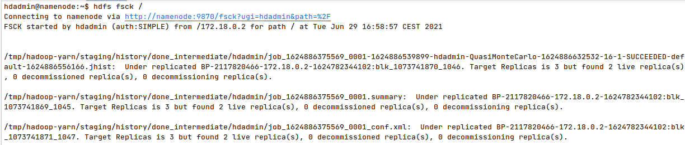

\pagebreak

# Ejecución del código FileSystemCat

Para esta primera parte hago los siguientes pasos:

- Descomprimo el código.
- Copio el código dentro del contenedor del namenode.
- Entro en el contendor.
- Cambio los permisos a la capeta que contiene el código para que se puedan compilar correctamente.
- Como el usuario luser creo el fichero `text_file.txt` y lo subo a hdfs.
- Compilo y ejecuto el código.

```bash
# download FileSystemCat.zip
unzip FileSystemCat.zip
docker cp FileSystemCat namenode:/home/luser
docker container exec -ti namenode /bin/bash
chown -R luser:luser /home/luser/FileSystemCat
su - luser
echo "aaaa
bbbb
cccc
dddd" > text_file.txt
hdfs dfs -put text_file.txt .
cd FileSystemCat
mvn package
cd target; hadoop jar hdfs-0.0.1-SNAPSHOT.jar text_file.txt
```

El resultado de la ejecución se puede ver en la siguiente captura.  


# Código CopyHalfFile

Para esta segunda parte he desarrollado el siguiente código :

```java
public class CopyHalfFile {
	public static void main(String[] args) throws Exception {
		String src = args[0];
		String dst = args[1];
				
		// Configuracion por defecto
		Configuration conf = new Configuration();
		
		// Entrada
		Path pathin = new Path(src);
		// TODO: Crear un FileSystem para la entrada y un FSDataInputStream para leer los datos
		FileSystem fsin = FileSystem.get(URI.create(src),  conf);
		FSDataInputStream fin = null;

		// Salida
		Path pathout = new Path(dst);		
		// TODO: Crear un FileSystem para la salida y un FSDataInputStream para escribir los datos
		FileSystem fsout = FileSystem.get(URI.create(dst),  conf);
		FSDataOutputStream fout = null;
		
		try {
			// TODO: Crear un FileStatus del filesystem de entrada a partir del cual obtener la longitud
			FileStatus fileStatus = fsin.getFileStatus(pathin);
			long fileSize = fileStatus.getLen();

			// TODO: Abrir los FSDataInputStream y FSDataOutputStream
			fin = fsin.open(pathin);
			fout = fsout.create(pathout);

			// TODO: Saltar a la mitad de InputStream de entrada
			fin.seek(fileSize/2);

			// TODO: Copiar del InputStream al OutputStream
			IOUtils.copyBytes(fin, fout, conf, false);

		} finally {
			// TODO: Cerrar los streams
			IOUtils.closeStream(fin);
			IOUtils.closeStream(fout);

		}		
	}
}
```

Para probar el programa ejecuto los siguientes comandos.
Copiar el código y entrar al contendor, como usuario luser compilo y ejecuto el programa.
Al final se muestran el contenido de los ficheros, el original y el nuevo.

```bash
# download CopyHalfFile.zip
unzip CopyHalfFile.zip
# edit CopyHalfFile
docker cp CopyHalfFile namenode:/home/luser
docker container exec -ti namenode /bin/bash
chown -R luser:luser /home/luser/CopyHalfFile
su - luser
cd CopyHalfFile
mvn package
cd target; hadoop jar hdfs-0.0.1-SNAPSHOT.jar text_file.txt out.txt
hdfs dfs -cat text_file.txt
hdfs dfs -cat out.txt
```

El resultado de la ejecución se puede ver en la siguiente captura.  


# Probar el comando hdfs dfsadmin

Para realizar esta parte se siguen los siguientes pasos:

- Entrar al contenedor namenode y cambiarse al usuario hdadmin.
- Se crea la carpeta `quota` en hdfs y se le establece una cuota (limite de ficheros 4).
- Se muestra el contenido para ver que está vacía.
- Se crea el fichero `one_file` y se intenta hacer 5 copias en la carpeta `quota`.
- Se vuelve a mostar el contenido de la carpeta para ver lo que hay.

A continuación los comandos usados.

```bash
docker container exec -ti namenode /bin/bash
su - hdadmin
hdfs dfs -mkdir quota
hdfs dfsadmin -setQuota 4 quota
hdfs dfs -ls quota
echo something > one_file
hdfs dfs -put one_file quota/file_0
hdfs dfs -put one_file quota/file_1
hdfs dfs -put one_file quota/file_2
hdfs dfs -put one_file quota/file_3
hdfs dfs -put one_file quota/file_4
hdfs dfs -ls quota
```

El resultado de la ejecución se puede ver en la siguiente captura.  


Como se puede ver en el resultado de la ejecución, al intentar crear el cuarto fichero da error de límite de cuota, lo cual se puede ver al final al mostrar los contenidos de la carpeta que solo se han creado 3 ficheros.

Como se estableció una cuota de límite 4 parece extraño que solo se puedan crear 3 ficheros, la respuesta es que la misma carpeta también cuenta para agotar límite de la cuota.
Como se indica en la [documentación de hadoop](https://hadoop.apache.org/docs/current/hadoop-project-dist/hadoop-hdfs/HdfsQuotaAdminGuide.html#Name_Quotas).

> [...]
> A quota of one forces a directory to remain empty. (Yes, a directory counts against its own quota!)

# Probar el comando hdfs fsck

Para empezar entro en el contendor y cambio al usuario hdadmin.

```bash
docker container exec -ti namenode /bin/bash
su - hdadmin
```

Ejecuto el comando `hdfs fsck /` para ver el estado inicial.  


No se ha detectado ningún error y todo esta correcto.

Ejecuto el siguiente comando para detener dos datanodes de forma brusca, como resultado solo quedaran dos datanodes activos.

```bash
docker container stop datanode2 datanode3
```

A continuación ejecuto el comando `hdfs dfsadmin -report` para ver el estado de los nodos activos.

Inmediatamente después de detener los datanodes el comando todavía los considera activos.  


Transcurridos unos minutos ya se indica que solo hay dos activos y que hay dos inactivos.  


A continuación vuelvo a comprobar el disco con el comando `hdfs fsck /`.  



Como se puede ver en las capturas salen errores y en el resumen del estado podemos ver que hay 40 bloques `under-replicated` que son el 100% de los bloques que hay en todo el disco.
Es lógico pues en la configuración se estableció que se crearan 3 réplicas de cada bloque, pero solo hay dos datanode por lo tanto es imposible que haya 3 réplicas de cada bloque.

A continuación recupero el fichero `random_words.txt.bz2` y calculo su hash para verificar que esta como al inicio.

```bash
hdfs dfs -get /user/luser/libros/random_words.txt.bz2
sha1sum random_words.txt.bz2
```


A continuación inicio un nuevo datanode con el siguiente comando.

```bash
docker container run -d --name datanode6 \
  --network=hadoop-cluster --hostname datanode6 --cpus=1 --memory=3072m \
  --expose 8000-10000 --expose 50000-50200 datanode-image /inicio.sh
```

Con los siguientes comandos le indico al namenode que hay un nuevo datanode.

```bash
echo "datanode6" >> ${HADOOP_HOME}/etc/hadoop/yarn.include
echo "datanode6" >> ${HADOOP_HOME}/etc/hadoop/dfs.include
yarn rmadmin -refreshNodes
hdfs dfsadmin -refreshNodes
```

Verifico con el comando `hdfs dfsadmin -report` que se ha detectado el nuevo datanode.  


Y también con el comando `yarn node -list`.  


Por último vuelvo a ejecutar `hdfs fsck /` para verificar que se han creado las réplicas de los bloques necesarias para alcanzar el factor de replicación por defecto.  


# Apéndice

Adjunto los ficheros y carpetas:

- `CopyHalfFile`: Directorio con el código de la segunda parte.
- `p1.sh`: Los comandos usados para hacer la parte 1.
- `p2.sh`: Los comandos usados para hacer la parte 2.
- `p3.sh`: Los comandos usados para hacer la parte 3.
- `p4.sh`: Los comandos usados para hacer la parte 4.

Los ficheros de comandos no están pensados para ser ejecutados en batch sino copiando y pegando cada uno de los comandos.
