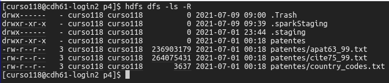
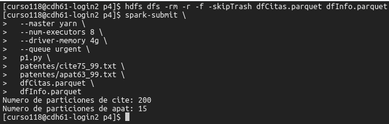
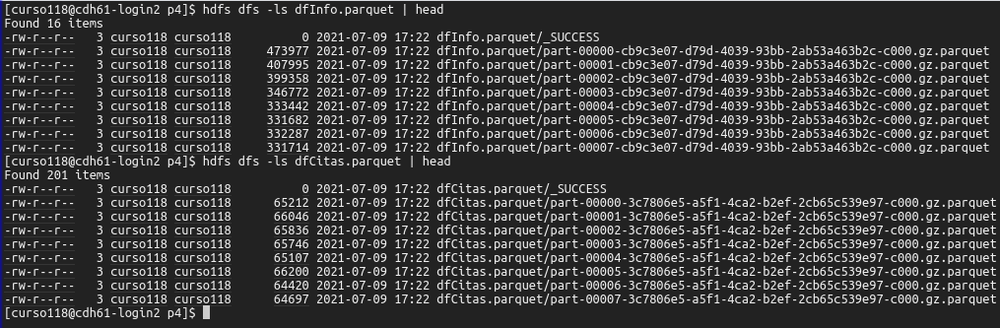
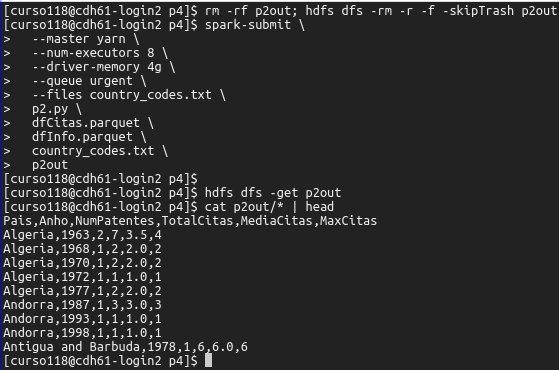

\pagebreak

# Tarea 1: Extraer información

En primer lugar la preparación de todas las tareas de esta práctica, copio los ficheros de datos a HDFS con los siguientes comandos.

```bash
# download patentes.tar.gz
tar xvzf patentes.tar.gz
hdfs dfs -put patentes .
hdfs dfs -ls -R
```



Para esta primera tarea he hecho el script `p1.py`.
Con las siguientes líneas de código leo los ficheros de datos en csv a un dataframe.

```python
cite = spark \
    .read \
    .option('inferSchema', 'true') \
    .option('header', 'true') \
    .csv(sys.argv[1])

apat = spark \
    .read \
    .option('inferSchema', 'true') \
    .option('header', 'true') \
    .csv(sys.argv[2])
```

A continuación con el método `selectExpr` me quedo con las columnas que me interesan y las renombro al nombre indicado.
En el caso del dataframe `cite` primor agrupo las filas por la columna _CITED_ y cuento las filas de cada grupo.

```python
cite = cite.groupBy('CITED') \
    .count() \
    .selectExpr('CITED as NPatente', 'count as ncitas')

apat = apat.selectExpr('PATENT as NPatente',
                       'COUNTRY as Pais',
                       'GYEAR as Anho')
```

Una vez tengo los datos necesarios los guardo en formato parquet, con compresión.

```python
cite.write.format('parquet') \
    .mode('overwrite') \
    .option('compression', 'gzip') \
    .save(sys.argv[3])

apat.write.format('parquet') \
    .mode('overwrite') \
    .option('compression', 'gzip') \
    .save(sys.argv[4])
```

Por último muestro el número de particiones del RDD de ambos dataframes con el método `getNumPartitions`.

```python
print('Numero de particiones de cite: {}'.format(cite.rdd.getNumPartitions()))
print('Numero de particiones de apat: {}'.format(apat.rdd.getNumPartitions()))
```

Para ejecutar esta tarea uso los siguientes comandos, en primer lugar se borran los directorios de salida y luego se ejecuta el comando `spark-submit`.

```bash
hdfs dfs -rm -r -f -skipTrash dfCitas.parquet dfInfo.parquet

spark-submit \
  --master yarn \
  --num-executors 8 \
  --driver-memory 4g \
  --queue urgent \
  p1.py \
  patentes/cite75_99.txt \
  patentes/apat63_99.txt \
  dfCitas.parquet \
  dfInfo.parquet
```



Con los siguientes comandos compruebo canutos ficheros se han generado en los directorios de salida.

```bash
hdfs dfs -ls dfInfo.parquet | head
hdfs dfs -ls dfCitas.parquet | head
```



Como podemos ver en el resumen de la salida de los comandos anteriores se crearon 16 archivos en la carpeta de salida donde se guardó el dataframe con las patentes con el código de pais.
Y en el caso del dataframe donde se cuentan las citas se crearon 201 archivos.

Como podemos comprobar, comparando con la salida del script de esta tarea, se crearon un archivo por cada partición más un archivo con el nombre `_SUCCESS`.

# Tarea 2: Contar patentes, total media máximo citas

Para esta primera tarea he hecho el script `p2.py`.
En este script en primer lugar leo los datos de salida de la tarea anterior con el siguiente código.

```python
cite = spark \
    .read \
    .format('parquet') \
    .option('mode', 'FAILFAST') \
    .load(sys.argv[1])

apat = spark \
    .read \
    .format('parquet') \
    .option('mode', 'FAILFAST') \
    .load(sys.argv[2])
```

Después leo el fichero `country_codes.txt` con la correspondencia entre el código de pais y el nombre del país.
Con la instrucción `spark.sparkContext.broadcast(country_codes)` indico que la el diccionario donde está almacenada la correspondencia es uan variable de broadcast.

```python
country_codes_path = os.path.basename(SparkFiles.get(sys.argv[3]))
country_codes = {}

with open(country_codes_path) as country_codes_file:
    for country_code in country_codes_file.readlines():
        (code, country) = country_code.strip().split('\t')
        country_codes[code] = country

ccb = spark.sparkContext.broadcast(country_codes)
```

A continuación hago el _join_ entre los dataframes `cite` y `apat`, le indico que lo haga en la columna `NPatente`, y con `inner` le indico que se quede solo con las filas que aparecen solo en ambos dataframes.
Seguidamente agrupo las filas por las columnas `Pais` y `Anho` e indico que se calculen los agregados con el método `agg`.
Además con el método `alias` le indico que renombre las columnas resultantes.

```python
data = cite.join(apat, 'NPatente', 'inner')

aggregates = data.groupBy(['Pais', 'Anho']).agg(F.count(data.NPatente).alias('NumPatentes'),
                                                F.sum(data.ncitas).alias('TotalCitas'),
                                                F.avg(data.ncitas).alias('MediaCitas'),
                                                F.max(data.ncitas).alias('MaxCitas'))
```

En las siguientes líneas de código, primero sustituyo la columna `Pais`, con una nueva creada a partir de la aplicación de una _UDF_ (función definida por el usuario) en cada fila de la columna `Pais` del dataframe previo.
La función está creada en la misma línea en la que se usa.
La función toma como parámetro el código de pais y devuelve el nombre completo del país.

Después se ordena el dataframe primero por la columna `Pais` y luego por la columna `Anho`.

Para terminar el dataframe resultante se guarda en formato csv sin comprimir y con encabezado.

```python
aggregates = aggregates.withColumn('Pais', F.udf(lambda x: ccb.value.get(x))(aggregates.Pais))
aggregates = aggregates.sort(aggregates.Pais, aggregates.Anho)
aggregates.write.csv(sys.argv[4], header=True)
```

Para ejecutar esta tarea uso los siguientes comandos, en primer lugar se borran los directorios de salida y luego se ejecuta el comando `spark-submit`.
Seguidamente se copian los resultados de HDFS a local y se muestra el principio.

```bash
rm -rf p2out; hdfs dfs -rm -r -f -skipTrash p2out

spark-submit \
  --master yarn \
  --num-executors 8 \
  --driver-memory 4g \
  --queue urgent \
  --files country_codes.txt \
  p2.py \
  dfCitas.parquet \
  dfInfo.parquet \
  country_codes.txt \
  p2out

hdfs dfs -get p2out
cat p2out/* | head
```



# Tarea 3: Contar patentes usando RDDs 

```bash
rm -rf p3out; hdfs dfs -rm -r -f -skipTrash p3out

spark-submit \
  --master yarn \
  --num-executors 8 \
  --driver-memory 4g \
  --queue urgent \
  p3.py \
  patentes/apat63_99.txt \
  p3out

hdfs dfs -get p3out
cat p3out/* | head
```
